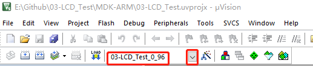

# WeAct Studio STM32H7xx C HAL 库例程使用说明

* [English Version](./README.md)

我们的工程包含内部Flash和外部Flash运行，使用时根据自己的需要选择对应的target，需使用AC5编译

## 以例程03为例，MDK-keil 编译运行显示LCD的程序

### `程序在内部Flash运行`

选择内部Flash运行的Target运行编译运行即可

### `程序在外部Flash运行`

程序在外部Flash运行，首先需要下载一个Bootloader，初始化QSPI外设，将QSPI Flash映射到0x90000000

1. 下载例程02，此例程为程序外部运行的Bootloader,可使用 WeAct Studio Download Tool 使用usb下载工程的hex文件，或者直接keil编译运行

2. 添加外部flash下载算法，参考`QSPI_Flasher`文件夹下的readme进行添加

3. 例程03，选择外部运行的Target，带有W25Qxx字样，0_96为0.96寸TFT，1_8为1.8寸TFT，编译运行下载

