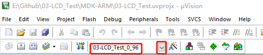

# WeAct Studio STM32H7xx Instructions for using C HAL library routines

* [中文版本](./README-zh.md)

Our project consists of an internal Flash and an external Flash run, using which target is selected according to your needs

## Take routine 03 as an example. Mdk-keil compiles and runs the program that displays the LCD

### `The program runs in internal Flash`

Select the Target run with internal Flash to compile and run
    

### `The program runs in external Flash`

To run the program in external Flash, you first need to download a Bootloader, initialize QSPI peripherals, and map QSPI Flash to 0x90000000

1. Download the routine 02, which is a Bootloader running outside the program, using the WeAct Studio Download Tool to Download the hex file from the project using USB, or run it directly by compiling keil

2. Add the external Flash download algorithm by referring to the README in the folder `QSPI_Flasher`

3. Routine 03, select externally run Target with W25Qxx, 0_96 for 0.96 inch TFT, 1_8 for 1.8 inch TFT, compile run download
    
