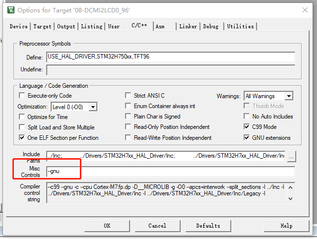

# WeAct Studio

* [English Version](./README.md)

## DCMI 2 LCD

将采集到的摄像头图像在LCD上显示出来, 支持OV7725,OV7670,OV2640,OV5640

> 使用长排线延长时，OV7725 XCLK时钟采用MCO1输出可能存在异常，可以使用`TIM1 Channel 1` PWM模式产生12Mhz方波时钟,但是使用TIM1输出XCLK时钟后与LCD的背光PWM冲突，故Camera_XCLK_Set自动设置LCD使用软件PWM控制

> OV5640 自动对焦未实现

## 注意事项

部分用户keil版本比较低，编译此例程会出错，原因是gnu拓展没有开启，在高版本的keil不会出现此问题，解决方法如图所示,加入--gnu，V5.27以上版本无需理会，因为gnu拓展已经勾选

