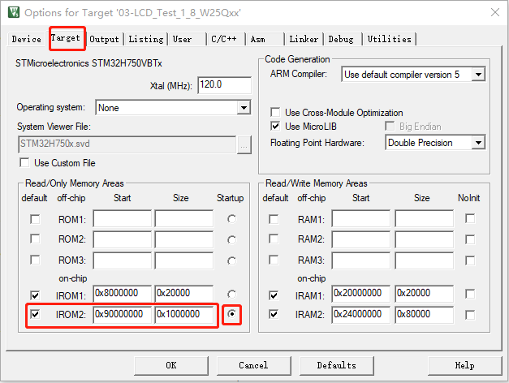
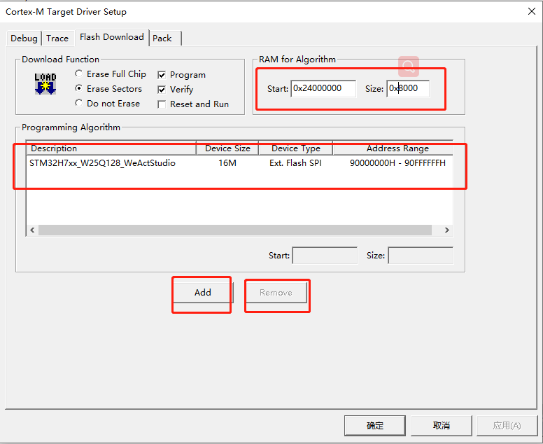
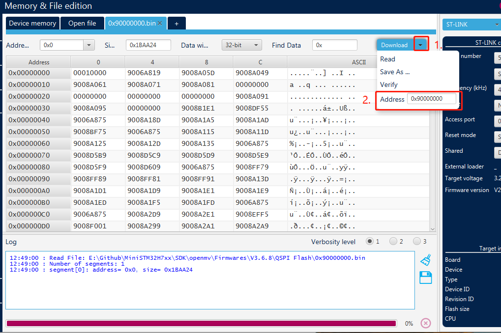

# QSPI Flasher

* [English Version](./README.md)

程序运行在外部flash的下载算法使用说明，支持MDK-keil和STM32cubeprog

## MDK-Keil工程配置

### STM32H7xx_W25Qxx_WeActStudio.FLM

.flm格式的文件为MDK keil使用的下载算法
> Keil MDK
支持 4MB ~ 16MB W25Qxx Flash

请将`STM32H7xx_W25Qxx_WeActStudio.FLM`文件复制到 `Keil安装目录\ARM\Flash\`

keil使用外部Flash运行程序时，需配置相关文件

1. 配置工程

    
2. 配置ROM下载地址

    
3. 配置下载算法

    
4. 移除其他下载算法，添加外部下载算法，注意只有一个下载算法

    

## STM32CubeProg 下载配置

### STM32H7xx_W25Qxx_WeActStudio.stldr

.stldr格式的文件为STM32CubeProg使用的下载算法

> STM32CubeProgrammer
支持 4MB ~ 16MB W25Qxx Flash

请将文件复制到 `STM32CubeProgrammer安装目录\bin\ExternalLoader\`

1. 配置外部Flash下载算法

    
2. 配置程序或固件下载地址(如.hex文件)

    
3. 如果是下载bin格式的文件则需要如下图所示设置(注意是.bin格式)

    
