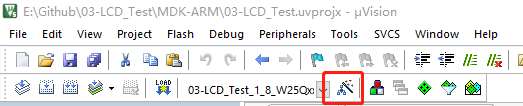
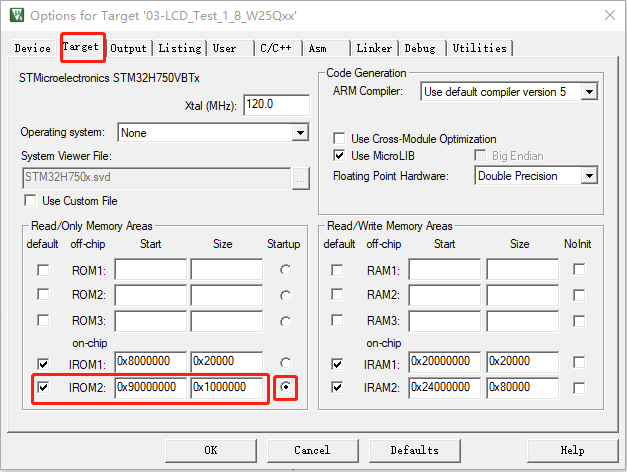
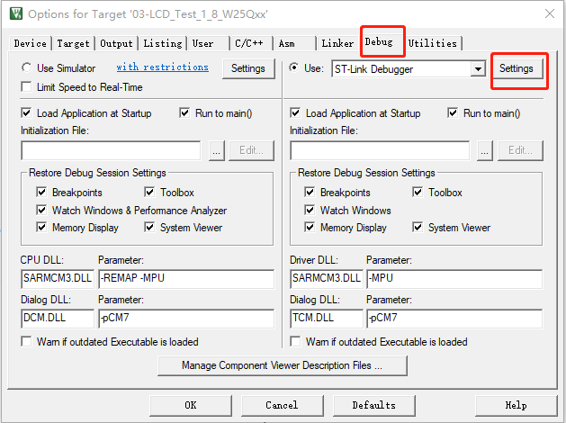
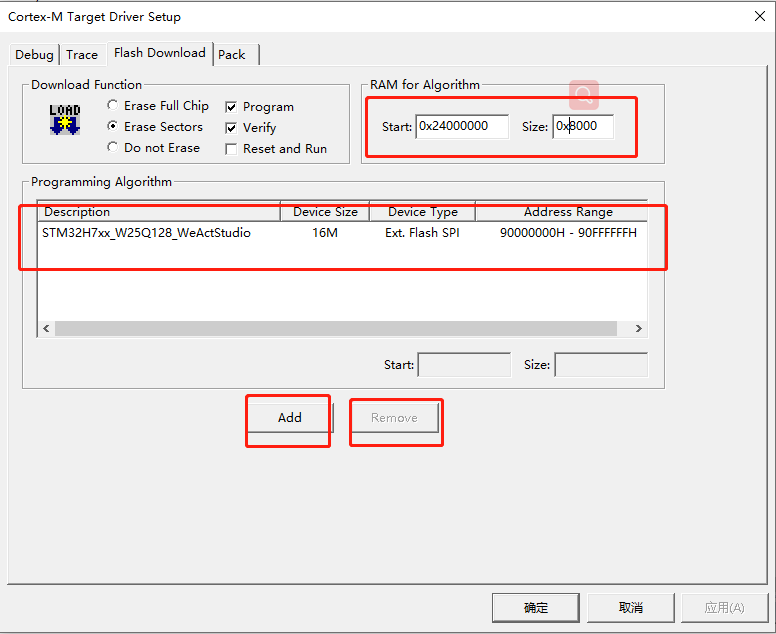
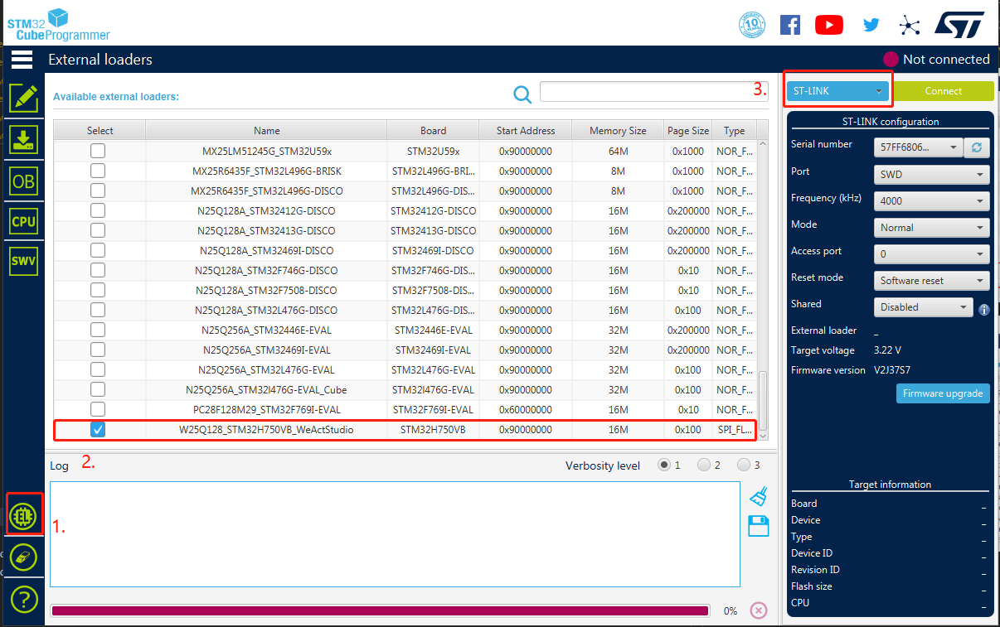
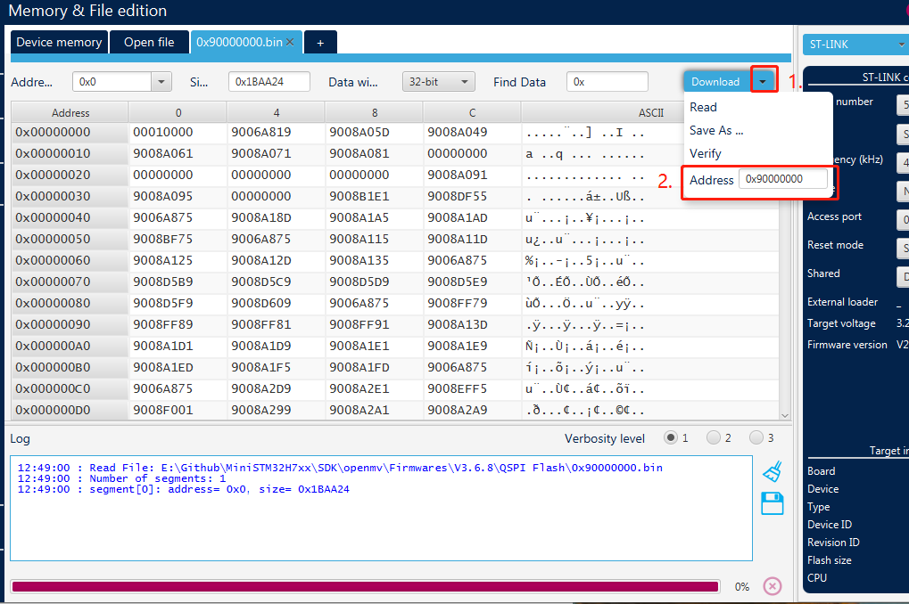

# QSPI Flasher

* [中文版本](./README-zh.md)

Program running in external Flash download algorithm using instructions, support MDK-Keil and STM32CubeProg

## MDK-Keil Project configuration

### STM32H7xx_W25Qxx_WeActStudio.FLM

The.FLM format file is the download algorithm used by MDK Keil
> Keil MDK
Support 4MB ~ 16MB W25Qxx Flash

Please copy the file to `"KeilInstallationDirectory"\ARM\Flash`

Keil needs to configure files when it runs programs using external Flash

1. The configuration of engineering

    
2. Configure the ROM download address

    
3. Configure download algorithm

    
4. Remove other download algorithms, add external download algorithms, and note that there is only one download algorithm

    

## STM32CubeProg Download configuration

### STM32H7xx_W25Qxx_WeActStudio.stldr

The .stldr file is the download algorithm used by STM32CubeProg

> STM32CubeProgrammer
Support 4MB ~ 16MB W25Qxx Flash

Please copy the file to `"STM32CubeProgrammerInstallationDirectory"\bin\ExternalLoader\`

1. Configure the external Flash download algorithm

    
2. hex or firmware download address (for example .hex file)

    
3. If you are downloading a file in bin format, you need to set it as shown in the figure below (note the.bin format)

    
