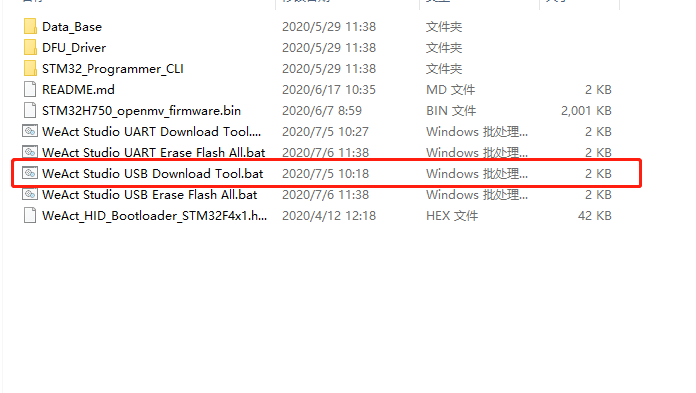
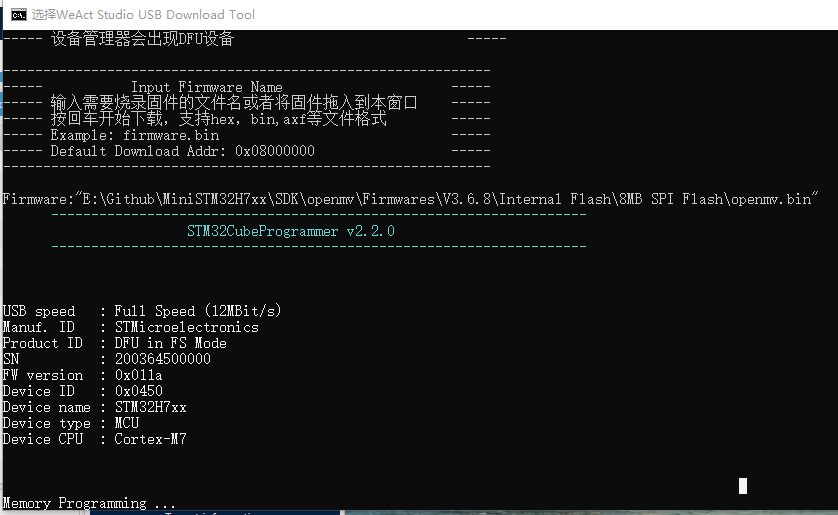
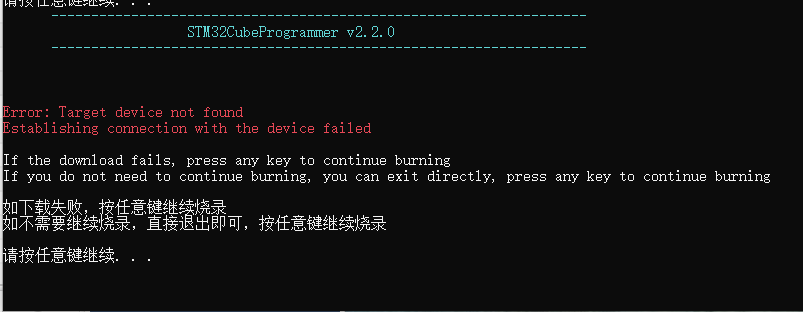
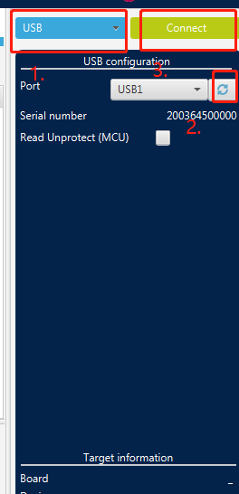

# WeAct Studio Download Tool

* [English Version](./README.md)

## 本下载工具可用于Openmv固件的烧录，或程序的下载，非常方便

> 实现USB一键下载固件

1. 按住BOOT0键，然后连接电脑
2. 设备管理器会出现DFU设备
3. 如果下载提示没有驱动，可以进入DFU_Driver文件夹，双击`STM32Bootloader.bat`进行安装
4. 双击`WeAct Studio USB Download Tool.bat`,输入目标固件名，回车即可开始下载

> 实现串口一键下载固件

1. 进入ISP模式
2. 使用串口连接单片机
3. 双击`WeAct Studio UART Download Tool.bat`,输入目标固件名，回车即可开始下载

## 如何进入ISP模式

* 方法1：上电状态下，按住BOOT0键和复位键，然后松开复位键，0.5秒后松开BOOT0键
* 方法2：掉电状态下，按住BOOT0键，上电后0.5S松开BOOT0
* DFU模式：使用数据线连接电脑即可
* 串口模式：使用USB转串口连接核心板的PA9,PA10即可
* 软件： STM32CubeProg

## 下载教程

### 使用 WeAct Studio Download Tool 下载

#### Win10用户可以用本工作室下载工具，Win7用户不支持，以USB下载为例

1. 解压 `WeAct Studio Download Tool.zip` , 打开 `WeAct Studio USB Download Tool.bat`

    
2. 根据脚本提示，设备进入ISP模式，固件拖入脚本，注意不是简单输入Firmware.hex, 然后回车，即可以下载固件或程序

    
3. 如果出现`Target device not found`，设备管理器如果出现的设备是STM Device in DFU Mode，需要右键卸载设备同时勾选删除此设备的驱动程序软件，之后再安装`WeAct Studio Download Tool/DFU_Driver/Driver/`目录下的驱动，选择`STM32Bootloader.inf`，右键点选安装，再重新进入ISP，回车下载

    

### 使用 STM32CubeProg 下载

#### Win10、Win7 用户均可以使用，以USB下载为例

1. 打开STM32cubeProg，没有的话去官网下载即可，[下载地址](https://www.st.com/zh/development-tools/stm32cubeprog.html)

2. 设备进入ISP模式，软件选择USB，刷新，连接

    

3 固件拖入STM32cubeprog即可，点击download，即可完成固件下载
