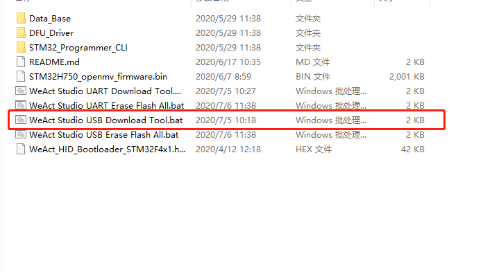
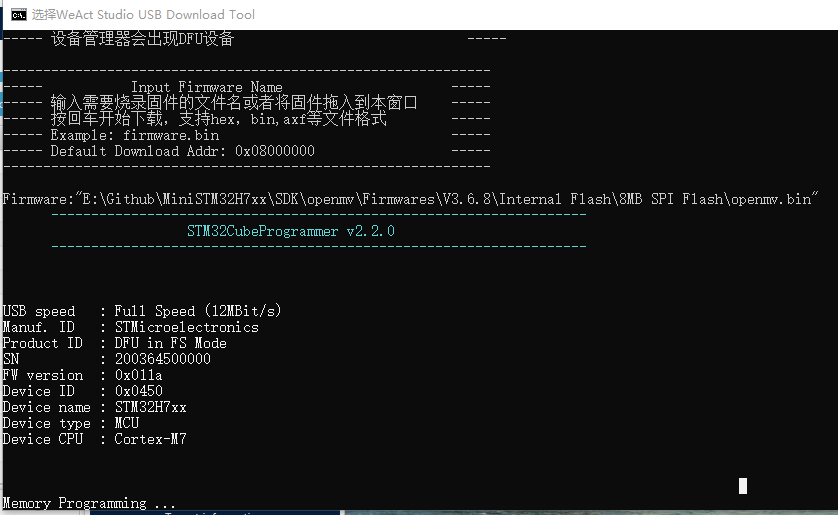
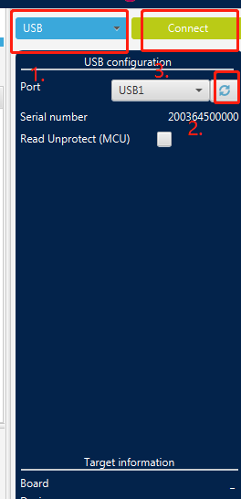

# WeAct Studio Download Tool

* [中文版本](./README-zh.md)

> USB Download

1. Hold down the BOOT0 key and connect to the computer

2. DFU devices will appear in the device manager

3. If there is no driver, you can enter the DFU_Driver folder and double-click `STM32Bootloader.Bat` to install

4. Double-click `WeAct Studio USB Download Tool. Bat`, enter the target firmware name and press enter to start downloading

> UART Download

1. Enter ISP mode

2. Use serial port to connect MCU

3. Double-click `WeAct Studio UART Download Tool.bat`, enter the target firmware name and serial port number, press `Enter` to start downloading

## How to enter ISP mode

* Method 1: When the power is on, press the BOOT0 key and the reset key, then release the reset key, and release the BOOT0 key after 0.5 seconds
* Method 2: When the power is off, hold down the BOOT0 key, and release the BOOT0 at 0.5s after the power is on
* DFU Mode: Use the data line to connect to the computer.
* Serial Port Mode: Connect PA9 and PA10 of core board with USB serial port
* Soft: STM32CubeProg。

## Download the tutorial

### Use WeAct Studio Download Tool to download

#### Win10 users can use the studio to download tools, Win7 users do not support, to USB download as an example

1. Unpack the `WeAct Studio Download Tool.zip` , Open `WeAct Studio USB Download Tool.bat`

    
2. Following the script prompt, the device enters ISP mode, the Firmware is pulled into the script, note that instead of simply typing Firmware. Hex, press enter, and you can download the Firmware or program

    
3. If `Target Device not found` appears, if the device is STM device in DFU Mode, you need to right click to uninstall the device and check to delete the Driver software of this device, then install the Driver in the directory `WeAct Studio Download Tool/DFU_Driver/Driver/`, select `STM32Bootloader.inf`, right click to install, then re-enter ISP, and press enter to Download

    

### Use STM32CubeProg to download

#### Win10, Win7 users can use, take USB download as an example

1. Open STM32cubeProg, if not, go to the official website to download it，[Download address](https://www.st.com/en/development-tools/stm32cubeprog.html)

2. The device enters ISP mode, and the software selects USB, refresh, and connect

    

3. Just drag the firmware into STM32cubeprog and click Download to complete the firmware download
